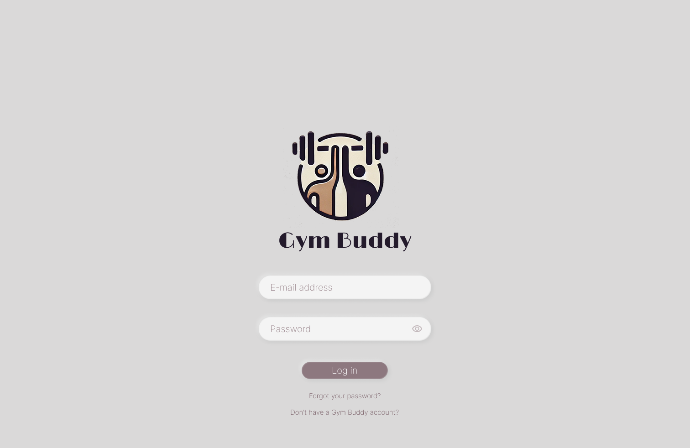
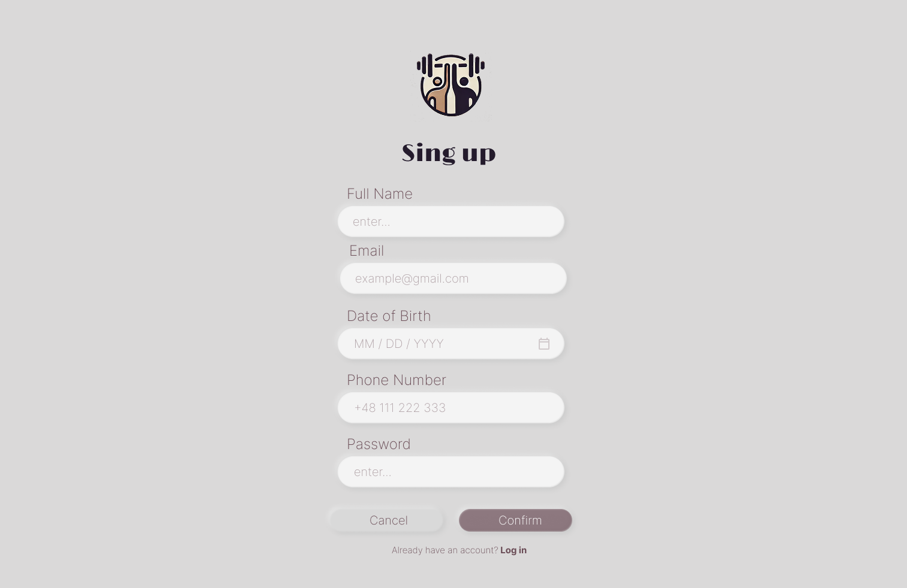
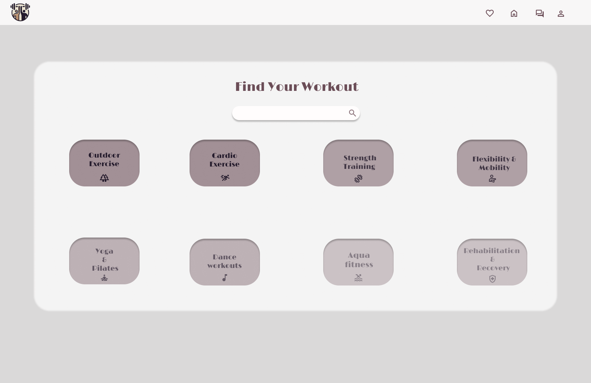
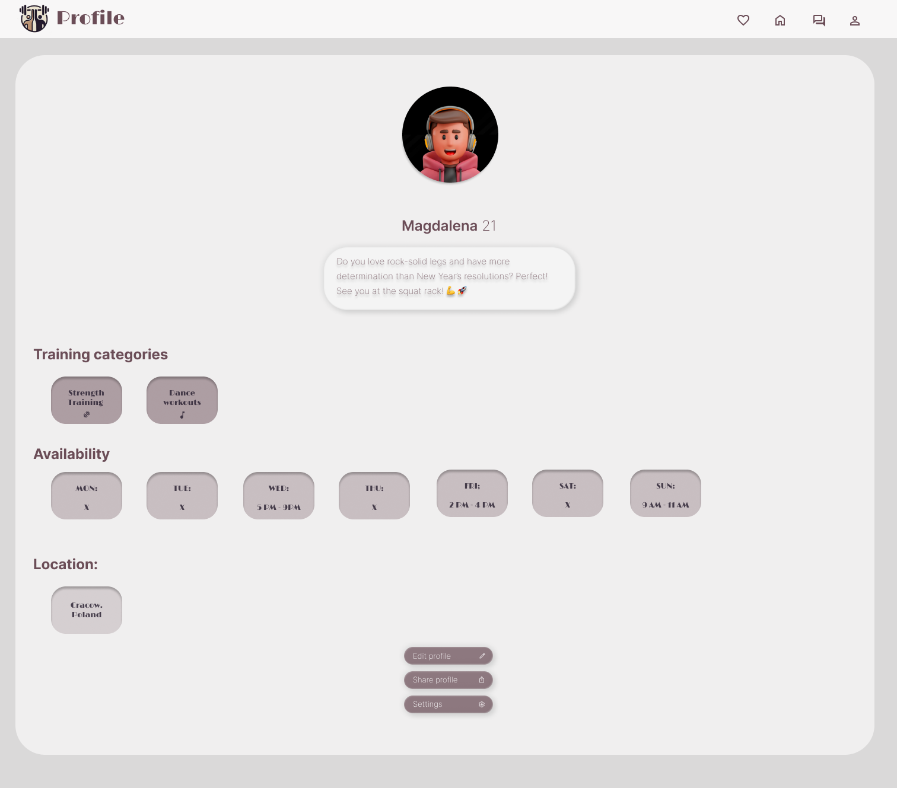

# 🏋️‍♂️ GymBuddy – System Umawiania Treningów

**GymBuddy** to portal umożliwiający użytkownikom wspólne planowanie treningów.  
Aplikacja pozwala na:

- tworzenie profili,
- wyszukiwanie partnerów treningowych,
- wysyłanie zaproszeń,
- dopasowywanie się,
- zarządzanie dostępnością.

## 🚀 Technologie

### Frontend
- **React.js** – do budowy komponentowego interfejsu użytkownika  
  > Wybrano React.js, ponieważ umożliwia szybkie tworzenie komponentowych interfejsów użytkownika i korzystanie z rozbudowanego ekosystemu narzędzi oraz bibliotek.
  
- **styled-components** – do modularnego stylowania  
  > Styled Components zapewniają czytelne, modularne stylowanie bez konfliktów nazw klas. Razem z React pozwalają tworzyć nowoczesny, przejrzysty i łatwy w utrzymaniu front-end.

### Backend 
- **TBA**

---
**🖼️ Prototyp Figma**

Do repozytorium dołączono screeny z prototypu aplikacji przygotowanego w Figmie, które przedstawiają kluczowe ekrany interfejsu użytkownika:

- 🔐 Panel logowania
  
- 📝 Panel rejestracji
  
- 🏋️ Ekran wyboru kategorii treningu
  
- 👤 Profil użytkownika
  

🔧 Wkrótce więcej szczegółów dotyczących konfiguracji, uruchamiania oraz architektury aplikacji.
